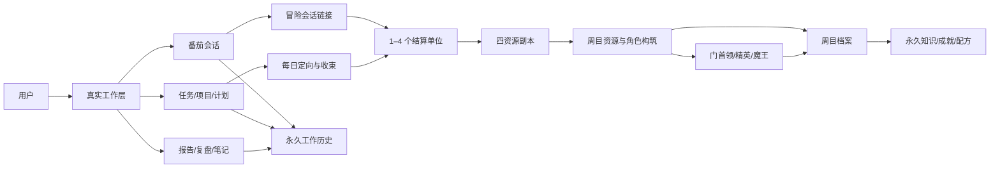
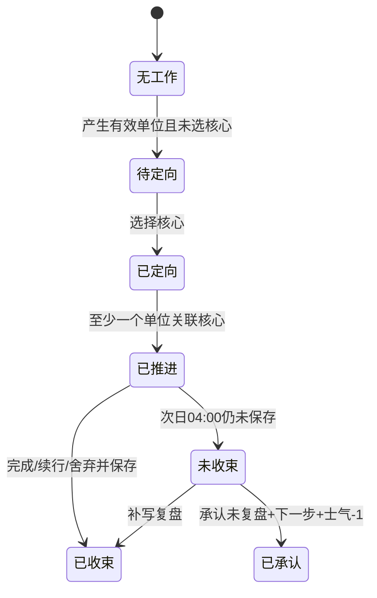
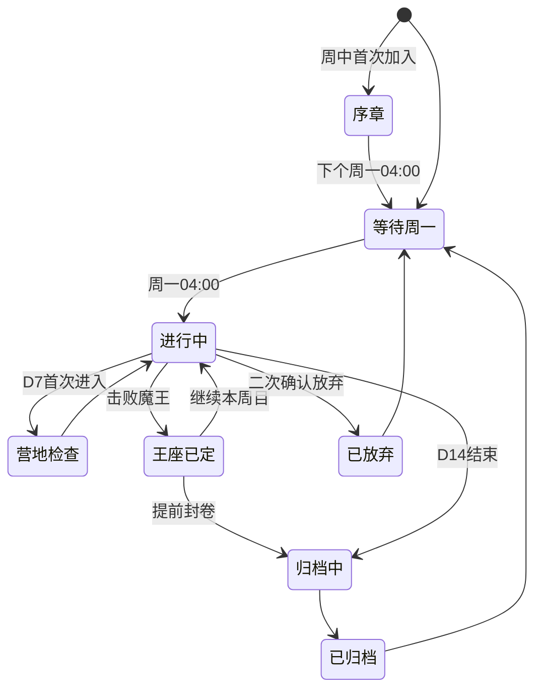

# 单×番 JRPG 技术架构、数据模型与验收规格

> 配套主设计：[单×番 JRPG 工作系统完整设计](./2026-08-28-jrpg-work-system-design.md)<br>
> 数值内容：[数值、经济、战斗与内容规格](./2026-08-28-jrpg-systems-and-content.md)<br>
> 职业内容：[八职业与完整技能树](./2026-08-28-jrpg-skill-trees.md)

## 1. 架构目标

新系统必须在不破坏现有任务、项目、计划、笔记、番茄钟和报告的前提下增加一个可版本化、可回放、可重置的周目层。Cloudflare Pages 继续承载前端，Supabase 继续负责认证、PostgreSQL、RLS 和原子 RPC。

系统设计优先级依次为：

1. 真实工作记录不能因游戏状态损坏。
2. 一次工作只能结算一次，随机结果不能刷新重抽。
3. 周目边界、掉落、合成、重置和赎回必须原子化。
4. 现有页面不能因为冒险功能增加一串首屏请求。
5. 进行中周目的规则不能在无提示下漂移。
6. 游戏模块可被隐藏或关闭，而工作模块仍完整可用。

## 2. 系统边界



关键隔离：

- 真实工作表是事实来源；冒险只引用，不反向修改它们。
- 报告算法读取真实数据，不读取战力后再改变结论。
- 冒险资源是周目账本，D14 可整体归档和清空。
- 旧扭蛋和藏品使用独立货币与表，不进入装备或战斗计算。

## 3. 规则版本

### 3.1 静态规则集

`adventure_rulesets` 保存一份不可变的版本化配置：

| 字段 | 含义 |
|---|---|
| `version` | 语义化版本，例如 `1.0.0` |
| `status` | draft / active / retired |
| `config` | EXP、掉落、商店、战斗上限、节律规则等 JSONB 快照 |
| `content_checksum` | 职业、物品、首领静态目录校验值 |
| `active_from` | 新周目可使用的时间 |
| `created_at` | 创建时间 |

每个 `adventure_campaigns` 在创建时写入 `ruleset_version` 和关键配置快照。当前周目始终读取自身版本，不读取“最新版本”。

### 3.2 修改策略

- 数值、内容、价格、掉率和行为规则只对下个周目生效。
- 文案、无障碍和纯视觉修复可以立即发布。
- 严重数据或安全错误允许兼容热修；热修必须留下 `compatibility_patch` 记录，并尽量不改变当前用户已看到的价格和概率。
- 前端遇到未知规则版本时只读展示，不尝试按本地最新版重算。

## 4. 数据生命周期

### 4.1 永久数据

| 表/实体 | 作用 | 生命周期 |
|---|---|---|
| 现有任务、项目、计划、番茄、笔记、报告表 | 真实工作事实 | 永久 |
| `adventure_profiles` | 时区、显示偏好、默认路线、功能开关 | 永久 |
| `adventure_campaign_archives` | 每周目摘要与最终快照 | 永久 |
| `adventure_codex_entries` | 敌人、意图、弱点、材料、装备知识 | 永久 |
| `adventure_recipe_discoveries` | 已发现炼药配方 | 永久 |
| `adventure_boss_records` | 首胜、最佳回合、失败史 | 永久 |
| `adventure_achievements` | 非数值成就、外观、营地陈设 | 永久 |
| 旧藏品和扭蛋记录 | 外观与历史 | 永久或用户可清库存、历史保留 |

### 4.2 周目数据

| 表/实体 | 关键内容 | D14 |
|---|---|---|
| `adventure_campaigns` | 时间、版本、状态、士气、债务、全局 T4 保底 | 归档后只读 |
| `adventure_campaign_characters` | 等级、EXP、SP、伤势 | 摘要归档后清空活动值 |
| `adventure_campaign_party` | 四人顺序和当前快照版本 | 归档 |
| `adventure_skill_unlocks` | 节点、投入账本、启用顶层 | 摘要归档后清空 |
| `adventure_inventory_balances` | 金币、材料、药材、药物、印记、晶石 | 清零 |
| `adventure_inventory_ledger` | 每笔资源来源与去向 | 压缩归档，保留审计摘要 |
| `adventure_equipment_instances` | 本体、Grade、R、家族、词条、装备者 | 构筑快照归档后清空 |
| `adventure_equipment_investments` | 赎回可返还的对象账本 | 归档后关闭 |
| `adventure_dungeon_states` | 解锁、各家族次数、精英进度 | 清零 |
| `adventure_alchemy_batches` | 制作、附魔、药包 | 清零 |
| `adventure_shop_purchases` | 限购与购买记录 | 归档 |
| `adventure_boss_attempts` | 当前/历史尝试和动作日志 | 摘要永久、临时状态关闭 |
| `adventure_daily_rhythm` | 定向、推进、收束、托管状态 | 永久摘要 |

## 5. 关系模型

### 5.1 核心表

#### `adventure_profiles`

- `user_id`：主键并引用认证用户。
- `timezone`：IANA 时区。
- `logical_day_start_hour`：固定为 4，字段保留未来版本化能力。
- `default_dungeon_id`、`default_material_family`。
- `game_visibility`：full / compact / focus-only。
- `reduced_motion`、`reward_animation_mode`。
- `active_campaign_id`。

#### `adventure_campaigns`

- `id`、`user_id`、`run_number`。
- `ruleset_version`、`ruleset_snapshot`、`campaign_seed`。
- `timezone_snapshot`、`starts_at`、`ends_at`。
- `status`：prologue / active / throne_settled / archiving / archived / abandoned。
- `morale`、`rescue_debt`、`consecutive_losses`、`t4_miss_count`。
- `day7_camp_used`、`redemption_seal_used`。
- `demon_king_defeated_at`、`ended_reason`。
- 唯一约束：一个用户同一时间只能有一个 prologue/active/throne_settled 周目。

#### `adventure_campaign_characters`

- 联合唯一：`campaign_id + character_catalog_id`。
- `level`、`exp`、`sp_total`、`sp_available`。
- `injured`、`fatigued_until`。
- `active_capstone_id`。
- 不持久化可由底盘、节点和装备推导的最终属性，避免双来源漂移；战斗开始时生成快照。

#### `adventure_campaign_party`

- `campaign_id`、四个固定 position。
- `character_id` 唯一，不能重复。
- `revision` 每次换队加一，用于结算与战斗快照。

### 5.2 技能与装备

#### `adventure_skill_unlocks`

- 联合唯一：`campaign_character_id + skill_node_id`。
- `sp_spent`、`material_family`、`materials_spent`、`license_id`、`catalyst_id`。
- `unlocked_at`、`t4_upgraded_at`。
- `ledger_transaction_id` 用于赎回。

#### `adventure_equipment_instances`

- `campaign_id`、`base_item_id`、`grade`、`slot`。
- `affinity_family`、`resonance_rank`。
- `affixes`、`temporary_enchantment`、`enchantment_battles_left`。
- `equipped_character_id`、`equipped_slot`。
- 装备本体不可卖回商店，避免买卖循环。

#### `adventure_equipment_investments`

- 每次调律、晶石嵌入、命运印记改词条都产生一行。
- 保存可返还的材料、对象绑定许可证、催化剂和不可返还金币。
- `settled_by_redemption_at` 确保只能结算一次。

### 5.3 资源账本

#### `adventure_inventory_ledger`

- `id`、`campaign_id`、`resource_type`、`resource_key`、`delta`。
- `reason_type`：dungeon / boss / shop / forge / synth / split / alchemy / injury / debt / redemption / reset。
- `source_id`、`idempotency_key`。
- `availability`：available / escrowed / spent / expired。
- 唯一约束：`campaign_id + idempotency_key + resource_key`。

`adventure_inventory_balances` 是事务内维护的余额投影；所有真相可由 ledger 重放。任何消费先锁余额行，验证 `available >= cost` 后再写负项。

### 5.4 副本与番茄链接

#### `adventure_session_links`

- `pomodoro_session_id` 唯一引用现有工作会话。
- `campaign_id`、`logical_date`、`party_revision`。
- `selected_dungeon_id`、`selected_target_family`、`tide_family`。
- `effective_units`、`settlement_status`。
- `core_task_id`、`rhythm_status`。

#### `adventure_reward_units`

- 联合唯一：`pomodoro_session_id + unit_index`，`unit_index` 只能为 1–4。
- `campaign_id`、`dungeon_id`、`target_family`、`party_snapshot`。
- `rng_seed`、`result`、`reveal_status`。
- `availability`：unassigned / escrowed / available / expired。
- `settled_at`；一旦有值，任何重试只能返回同一结果。

#### `adventure_dungeon_states`

- 联合唯一：`campaign_id + dungeon_id + route_key`。
- `unlocked_at`、`clear_count`、`elite_cache_count`、`optional_elite_unlocked_at`。
- 全局 T4 miss 不放在路线行，统一位于 campaign，防止切线复制保底。

### 5.5 节律与战斗

#### `adventure_daily_rhythm`

- 联合唯一：`campaign_id + logical_date`。
- `core_task_id`、`direction_saved_at`。
- `core_unit_count`、`progress_achieved_at`。
- `closure_outcome`：completed / continue / abandoned / acknowledged_without_review。
- `closure_text`、`next_action`、`closure_saved_at`。
- `escrow_reason`、`morale_delta`。

#### `adventure_boss_attempts`

- `campaign_id`、`boss_id`、`ruleset_version`、`attempt_seed`。
- `party_snapshot`、`equipment_snapshot`、`skill_snapshot`、`inventory_snapshot`。
- `status`：active / suspended / retreated / defeated / won / invalidated。
- `action_log`、`current_state`、`result_digest`。
- `started_at`、`finished_at`。
- 一个用户同一时刻只能有一个 active/suspended 尝试。

## 6. 静态目录

以下内容用版本化只读目录保存，而不是散落在 React 组件：

- `character_catalog`
- `skill_node_catalog`
- `active_skill_catalog`
- `equipment_catalog`
- `affix_catalog`
- `material_catalog`
- `alchemy_ingredient_catalog`
- `alchemy_recipe_catalog`
- `dungeon_catalog`
- `boss_catalog`
- `boss_action_catalog`
- `shop_catalog`
- `achievement_catalog`

目录同时存在 TypeScript 类型和数据库版本；构建时校验 ID、引用、节点数量、武器类型、材料家族和校验和。前端可以长期缓存目录，但所有交易使用服务器规则集。

## 7. 核心 RPC

RPC 名称是设计接口，可在实施时按现有命名规范调整，但职责不能合并成由客户端自行计算的多步写入。

| RPC | 事务职责 |
|---|---|
| `get_adventure_summary` | 一次返回工作台/冒险页需要的周目、队伍、余额、待办和保底摘要 |
| `ensure_current_campaign` | 懒创建序章或周目，处理到期归档，固定规则与时区 |
| `settle_work_session` | 验证工作会话，创建 0–4 个唯一结算单位并生成奖励 |
| `assign_pending_units` | 给尚未生成结果的待派遣单位指定已解锁副本并一次生成结果 |
| `set_daily_direction` | 写今日核心并释放满足条件的托管奖励 |
| `close_daily_rhythm` | 保存完成/续行/舍弃/承认未复盘，处理士气和托管 |
| `change_party` | 验证四人唯一并增加 party revision |
| `unlock_skill_node` | 验证等级、前置、SP、材料、许可证并原子扣除 |
| `set_active_capstone` | 只在营地切换已解锁顶层 |
| `purchase_shop_item` | 验证余额、限购、许可证和库存 |
| `synthesize_material` | 3:1 升阶并写可撤销事务 |
| `split_material` | 1:2 降阶并写可撤销事务 |
| `undo_last_material_operation` | 仅回滚未被下游消费的最后一笔 |
| `tune_equipment` | 验证顺序、家族、材料、催化剂和服务费 |
| `use_destiny_seal` | 确定性替换合法同类词条 |
| `redeem_build` | 一次性重置对象，按账本返还并消耗赎回印记 |
| `brew_recipe` | 验证永久配方或确定性实验并原子扣料 |
| `start_boss_attempt` | 验证整备要求，锁定完整战斗快照和种子 |
| `save_boss_actions` | 追加动作日志并保存可恢复状态 |
| `finish_boss_attempt` | 服务端重放、验证结果并结算首胜/伤势/债务/士气 |
| `archive_campaign` | 写永久摘要后原子关闭全部周目资源 |

所有写 RPC 都接收客户端生成的 operation UUID，并对同一 UUID 返回相同结果。

## 8. 工作会话结算算法

### 8.1 前置事实

结算只能引用已保存的工作类型 `pomodoro_session`，不能引用休息记录。服务端使用现有会话中的实际秒数，而不是客户端传入的“番茄数”。

```text
minutes = floor(actual_duration_seconds / 60)
effective_units = min(4, floor(minutes / 25))
```

### 8.2 原子流程

1. 使用 `auth.uid()` 读取并锁定工作会话、当前周目和现有 session link。
2. 验证会话属于当前用户、类型是工作、状态为完成、时长非负。
3. 若 session link 已存在，返回已生成的相同单位，不重复生成。
4. 计算 0–4 单位；0 单位只写中断遥测，不创建奖励行。
5. 锁定会话完成时的逻辑日、时区、四人 party revision、路线、目标家族和潮汐。
6. 若路线未选或未解锁，创建 `unassigned` 单位，不提前生成随机结果。
7. 若路线有效，按 unit_index 顺序生成结果；材料副本必须串行更新全局 T4 保底和路线每 4 次计数。
8. 根据每日定向/收束状态写 available 或 escrowed ledger。
9. 提交事务后才允许前端播放动画。

同一次长会话默认四个单位使用同一副本、目标家族、潮汐和队伍快照。用户不能在看见前三个结果后修改第四个路线。

### 8.3 随机种子

每个单位的服务器种子至少绑定：

```text
campaign_seed + session_id + unit_index + dungeon_id + ruleset_version
```

数据库存储最终种子和完整结果。前端动画只读取结果，不执行决定掉落的 `Math.random()`。

## 9. 每日托管状态机



规则：

- 待定向奖励已生成但在 escrow；指定核心并关联至少一个单位后释放。
- “未收束”不会追回已经消费的旧奖励；它只让之后新产生的周目资源进入 escrow。
- 补写收束不扣士气；“承认未复盘”扣 1 士气并释放。
- 连续多个未收束日逐日保留，不合并伪造文本；用户可以逐个选择承认。
- D14 前持续提醒尚有托管资源；周目归档时未释放资源标为 expired，但真实工作记录永久保留。

## 10. 战斗执行模型

### 10.1 开始

`start_boss_attempt` 在一个事务内：

1. 验证首领可见、没有其他活动尝试、连续失利门槛已解除。
2. 锁定当前四人、属性、三主动、奥义、启用顶层、羁绊、装备、药包、附魔、知识和封印。
3. 生成 attempt seed 和首领意图序列。
4. 返回只读战斗快照。

战斗中更改编队、装备或技能不会影响已经开始的尝试。

### 10.2 客户端与服务器

- 客户端使用纯 reducer 即时演算，保证动画流畅。
- 每个动作包含回合号、行动者、动作 ID、目标、客户端前态摘要和 operation UUID。
- 每轮结束或应用离开前追加保存；刷新页面恢复同一个 attempt，不创建新种子。
- 最终结算由服务器从初始快照重放完整动作日志。
- 客户端结果与服务器不一致时标记 invalidated，保留诊断，不施加胜利或战败惩罚；用户可以从最后一个已验证轮次继续。

### 10.3 结果

- 胜利：验证首胜、解锁、催化剂和图鉴；只有击败本次失利目标，或风险等级不低于它的尚未首胜目标，才清除连续失利。重复击败低阶首领不能洗掉高阶失败。
- 撤退：按是否已有首个行动结算疲劳和连续失利。
- 战败：确定性地给本次四人伤势、债务和士气，不随机选人。
- 重复首领胜利不产可刷资源，只刷新个人最佳记录。

## 11. 周目状态机



归档正确性不能依赖浏览器在 D14 正好打开：

- 所有冒险 RPC 的第一步都调用轻量 `ensure_current_campaign`。
- 发现过期活动周目时先在事务内归档，再创建当前应有状态。
- 可另设定时任务用于通知和预计算，但没有定时任务时数据仍正确。

## 12. 时间、跨日与离线

| 场景 | 规则 |
|---|---|
| 逻辑日 | 周目锁定 IANA 时区，每日 04:00 分界 |
| 夏令时 | 使用时区数据库换算，不用固定 UTC offset |
| 跨 04:00 会话 | 默认归属会话开始时的逻辑日 |
| 用户纠正归属 | 当前周目内可把一条会话改到相邻逻辑日一次；掉落潮汐仍按原完成时锁定，防止改日刷潮汐 |
| 离线计时 | 客户端使用单调时钟保存开始、暂停、结束事件；恢复后计算实际时长 |
| 离线同步 | 每个操作带 UUID；服务端幂等写入，跨设备重复不增发 |
| 72 小时内补传 | 若周目仍活动，可生成正常周目结算 |
| 周目已归档 | 仍补真实工作历史，不给已经结束周目的资源 |
| 改时区 | 当前周目不变，下周目生效 |

手工新建或修改历史时长不自动产生冒险奖励。只有计时器生成、具有完整事件链并最终标记完成的会话可结算；这是正确性边界，不是防作弊竞赛。

## 13. 安全与 RLS

### 13.1 基本要求

- 所有用户周目表启用 RLS，只允许 `user_id = auth.uid()` 的行。
- 关系表通过所属 campaign 再验证 auth.uid，不能只信客户端传入 campaign ID。
- 静态目录允许认证用户只读；客户端无写权限。
- Supabase service role key 永不进入 Cloudflare Pages 前端包。
- 所有 `SECURITY DEFINER` 函数固定 `search_path`，内部再次检查 `auth.uid()`，不接收可冒充的 user_id。
- 交易参数使用目录 ID，不接收客户端自报价格、概率、余额或最终结果。
- JSONB 结果在写入前按 schema 校验。

### 13.2 并发锁

- 结算锁 `pomodoro_session` 和 campaign。
- 材料结算额外锁 campaign 的全局 T4 计数和目标路线状态。
- 购买锁商品限购行与金币余额。
- 合成、锻造、炼药和赎回锁所有涉及的余额及对象账本。
- 周目归档获取 campaign 级 advisory lock，防止结算与清零交错。

### 13.3 关键唯一约束

- `reward_units(session_id, unit_index)`。
- `transaction_ledger(campaign_id, idempotency_key, resource_key)`。
- `boss_first_clear(campaign_id, boss_id)`。
- `shop_purchases(campaign_id, item_id, purchase_index)`。
- `skill_unlocks(character_id, node_id)`。
- 一个角色一个装备槽只能有一个装备；一件装备最多被一个角色装备。

## 14. 性能设计

### 14.1 请求边界

- 工作台只增加一次紧凑 `get_adventure_summary`，且游戏隐藏时可以不请求。
- 冒险页首屏一次汇总返回地图、队伍、余额、门状态和待结算；技能树、图鉴、商店目录按标签懒加载。
- 静态目录随规则版本长期缓存；用户余额和状态短缓存并合并进行中的相同请求。
- 奖励动画一次取整批结果，不为四个单位串行请求四次。
- 报告读取按日/周/月聚合表或单次 RPC，不逐日请求。

### 14.2 索引

至少覆盖：

- campaign：`user_id + status`、`user_id + starts_at/ends_at`。
- session link：`pomodoro_session_id`、`campaign_id + logical_date`。
- reward unit：`campaign_id + availability`、唯一 session/unit。
- ledger：`campaign_id + resource_type + resource_key`、`source_id`、`idempotency_key`。
- boss attempt：`campaign_id + status`、`boss_id + finished_at`。
- daily rhythm：`campaign_id + logical_date`。
- codex/recipe：`user_id + catalog_id`。

### 14.3 体验指标

在正常网络和已认证状态下的目标：

| 指标 | 目标 |
|---|---:|
| 已缓存工作台可交互 | p75 < 1.5s |
| 冷启动工作台可交互 | p75 < 2.5s |
| 工作台→冒险页首屏 | p75 < 1.2s |
| 普通结算 RPC | p95 < 700ms |
| 四单位材料结算 RPC | p95 < 1,200ms |
| 标签内切换 | p75 < 300ms |
| 奖励队列打开 | 本地立即，后台校验不阻塞首帧 |

这些指标通过真实 Supabase 测试环境测量，不能只用 mock。

## 15. 现有数据迁移

### 15.1 加法迁移

- 不改写现有任务、项目、每日计划、番茄、复盘、笔记、报告、扭蛋和藏品行。
- 新冒险表通过外键或关联表引用现有番茄和任务。
- 不为历史番茄补发金币、EXP 或材料。
- 旧扭蛋代币、藏品与月度同步继续有效，但明确标记为“收藏系统”，战斗查询不连接这些表。

### 15.2 首次启用

- 功能开关默认对测试账户开放，再逐步扩大。
- 用户第一次进入新版本时，若处于周中，进入序章；下周一再开始正式周目。
- 弹窗用一页清楚说明 14 日会重置哪些数值，不以冗长协议隐藏。
- 用户可始终选择“纯工作模式”；选择不会删除冒险档案。

### 15.3 回滚

- 关闭功能开关后，所有现有工作页面仍能运行。
- 冒险数据只读保留，不删除。
- 未完成的冒险事务依靠数据库原子性回滚，不在前端补偿余额。
- 数据库迁移按新增表/函数设计，回滚前先停写，不对现有工作表执行 destructive rollback。

## 16. 自动化验证矩阵

### 16.1 计时与结算

| 分钟 | 预期单位 |
|---:|---:|
| 0 | 0 |
| 24 | 0 |
| 25 | 1 |
| 49 | 1 |
| 50 | 2 |
| 74 | 2 |
| 75 | 3 |
| 99 | 3 |
| 100 | 4 |
| 180 | 4 |

还必须测试：

- 同日三次 50 分钟产生 6 个单位，没有每日封顶。
- 5 分钟休息进入休息历史但产生 0 个单位。
- 工作类型伪装、负时长、重复同步、跨设备同时同步都不能增发。
- 同一 session/unit 重试返回字节级相同的结果。

### 16.2 材料属性测试

- 普通三抽只出现 70/25/5 的 T1–T3。
- 宝箱只出现 20/45/32/3 的 T1–T4。
- 同一目标路线第 4、8、12 次恰有精英藏匣。
- 连续 11 次无 T4 后，第 12 次必为当前目标家族 T4。
- 切换家族不重置全局 miss count，也不复制精英计数。
- 目标≠潮汐时长期家族分布为 50/30/5/5/5/5；目标=潮汐时为 75/5/5/5/5/5。
- 周日潮汐使用会话完成日，不使用领奖日。
- 其他三个副本永不产生 T2+。

Monte Carlo 至少使用 100 万次独立品质抽和 10 万个 20 次周目片段，实际比例应落在预先设定的统计置信区间内；保底和第 4 次规则用穷举状态测试，不依赖概率。

### 16.3 经济与库存

- 56/84/112 三种参考分配的金币、EXP 和等级与规格表一致。
- 3:1 升阶、1:2 降阶加服务费永远不能套利。
- 预留材料不被批量操作选择。
- 撤销只作用于最后一笔未消费产物。
- 任何并发消费都不能令余额为负。
- 商店限购、职业许可证、晶石槽和两个命运印记正确。
- 赎回只执行一次，按对象账本返还，不返金币、全局许可证或其他对象资源。

### 16.4 技能与装备

- 静态目录验证八职业各有 1+15 节点、3 基础主动、1 奥义和 3 个 T4 升格。
- 等级门槛、SP、前置、材料和许可证缺一不可。
- 多顶层可解锁但战斗快照只有一个启用。
- 替补羁绊不进入快照。
- 武器类型只能是剑、枪、短剑、斧、弓、杖。
- 武器不把主动技能写入负载。
- 同家族 R4 被动不叠加；调律必须 R1→R4 顺序。
- R2 后改家族只能通过赎回完整重置。

### 16.5 炼药

- 素材不能进入成长材料合成函数。
- 同一标签组合始终得到同一配方。
- 不兼容组合只能生成淡化膏，不能返还更多素材。
- 药包 6、复起药 1、Buff 1、涂剂 1、首领减益 1 的限制正确。
- 用户特殊药效不改工作分钟、session status 或 reward units。

### 16.6 战斗

- 同一快照、种子、动作日志得到完全相同结果。
- 页面刷新恢复同一 attempt 和意图序列。
- 弱点、抗性、破势、暴击、减伤和方差符合公式。
- Break 取消蓄力、跳过恰好一次行动、随后按次数增加条值。
- 每角色每轮最多一次行动；追射、反击和 DOT 不触发完整行动链。
- 所有全局上限在最极端四职业组合下仍成立。
- 胜利首奖不能重复；重复挑战不产刷取资源。
- 未击败四门时魔王封印逐项准确，仍允许进入。

### 16.7 失败与节律

- 行动前退出无后果，行动后撤退有疲劳。
- 战败精确作用于本次四人，伤势不随机、不叠两层。
- 已伤角色再败产生 100 债务，单次与周目上限正确。
- 连续两败后只锁手动挑战；完成一个有效单位或次日解除。
- 未定向奖励托管；定向并推进后释放，结果不改变。
- 未收束只托管后续奖励；补写不扣士气，承认未复盘扣 1。
- 没有工作单位的日期不创建惩罚。

### 16.8 周目、时区与离线

- 周一 04:00、D7、D14、夏令时切换和跨日会话。
- 周中首次加入只能序章，正式资源不泄漏。
- 当前周目锁定旧规则和旧时区。
- D14 后晚同步只补真实历史，不补周目资源。
- 归档与最后一次结算并发时，二者只能按事务顺序得到一个合法结果。
- 主动放弃二次确认，真实记录和永久知识仍保留。

### 16.9 安全

- 用户 A 不能读取、猜测、修改或结算用户 B 的 campaign/session/equipment。
- 客户端自报价格、EXP、掉落、boss win、duration 或 user_id 都被忽略或拒绝。
- 重放 operation UUID 不重复写。
- RPC `search_path`、RLS、函数 owner 和授权由迁移测试检查。

### 16.10 无障碍与视觉回归

- 色盲模式下六相仍可通过图标、文字和纹理区分。
- 键盘可完成计时、路线选择、领奖、编队、技能、商店和战斗。
- reduced motion 取消非必要动画。
- 320px 宽度使用列表地图，不横向溢出。
- 计时器从自定义输入切到计时数字不发生容器尺寸跳动。
- 图表均有同数据表格；屏幕阅读器不朗读装饰纹理。

## 17. 人工体验验收

自动测试通过后，使用一套 14 日压缩测试剧本：

1. 新用户周中进入序章，完成真实工作但不拿正式资源。
2. 周一建立四人队，击败金币门，完成第一笔扫荡。
3. 完成一次 124 分钟会话，确认记录 124 分钟、只发 4 次结算。
4. 故意不选核心，确认工作不丢、奖励托管；随后定向并释放。
5. 依次解锁四副本，验证推荐顺序不是硬锁。
6. 在材料路线触发第 4 次精英藏匣和第 12 次 T4 保底。
7. 点出两个顶层并在营地切换，战斗内只有一个。
8. 制作恢复、附魔、首领减益和用户特殊药，确认互不越界。
9. 故意连续失败两次，确认伤势、整备门槛、恢复与债务。
10. D7 整备一次，不发生半周重置。
11. 未清一个门首领直接挑战魔王，确认只增加对应封印。
12. 使用赎回印记重置一次，尝试第二次必须失败且库存正确。
13. D14 归档，核对永久/重置清单，再开始相同体验的新周目。

## 18. 风险与设计对策

| 风险 | 触发方式 | 对策 |
|---|---|---|
| 游戏反过来打断工作 | 中途事件、强制领奖、红点过多 | 工作期间零弹窗；结果排队；纯工作模式；动画可跳过。 |
| 过度工作换资源 | 无限长会话获得无限奖励 | 单次最多 4 单位，超时只保留真实记录；不做排行榜。 |
| 惩罚让用户放弃 | 丢资源、永久伤、断签羞耻 | 惩罚只在周目，明确上限和恢复；空白日不处罚。 |
| 高活跃买空系统 | 线性金币和永久数值 | 周目重置、横向装备/第二队、限购、催化剂和一个启用顶层。 |
| 随机破坏规划 | T4 偏家族、刷新重抽 | 目标/潮汐可见、12 次当前目标保底、结果先存后播。 |
| 队伍出现必带职业 | 商人/盗贼影响收益 | 所有职业只影响战斗；掉落不读取队伍。 |
| 功能数量拖慢页面 | 每卡片独立请求 | 汇总 RPC、懒加载、静态目录缓存、进行中请求合并。 |
| 周目重置造成误解 | 用户以为真实数据被清空 | D12 起预览清单；真实记录与周目资源用不同视觉层和文案。 |
| 规则热更新不公平 | 当前周目掉率变化 | campaign 固定 ruleset，平衡只作用下周目。 |
| 客户端并发重复结算 | 断网重试、多设备 | operation UUID、唯一约束、行锁、服务端原子 RPC。 |
| 内容像既有 JRPG | 直接复制名称、美术、音乐 | 原创角色、地图、纹理和文本，只保留通用系统结构。 |

## 19. 完成定义

这一功能不能以“页面能打开”作为完成。只有同时满足以下条件才可进入生产发行候选：

- 三份业务规格和本技术规格中的不变量都有自动测试。
- 56/84/112 三档模拟、100 万次掉落统计和完整 14 日压缩剧本通过。
- RLS、并发、幂等、D14 归档和赎回账本经过数据库集成测试。
- 现有任务、项目、每日计划、番茄、笔记、报告、扭蛋和藏品回归测试通过。
- 工作台和冒险页达到性能目标，不重新引入串行逐日请求或重复首屏请求。
- 桌面、移动、键盘、屏幕阅读器和 reduced motion 验收通过。
- 产品内明确展示规则版本、周目结束时间、掉落概率、保底进度、惩罚和恢复路径。
- 经过至少一个真实 14 日内部体验周目后，才依据“首次体验调节旋钮”确定生产数值。

本文件只定义实现目标，不授权当前阶段修改数据库、业务代码、部署或推送。
